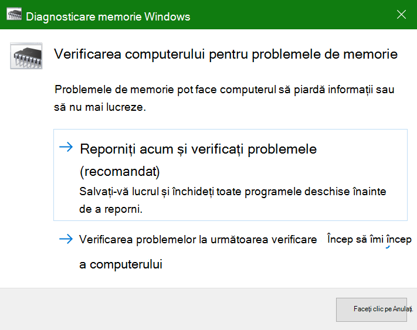

# Executarea diagnosticelor de memorie Windows în Windows 10Run Windows Memory Diagnostics in Windows 10

Dacă Windows și aplicațiile de pe PC se blochează, înghedează sau acționează într-un mod instabil, este posibil să aveți o problemă cu memoria PC-ului (RAM).If Windows and apps on your PC are crashing, freezing, or acting in an unstable manner, you may have a problem with the PC’s memory (RAM). Aveți posibilitatea să executați Windows Memory Diagnostic pentru a căuta probleme cu memoria RAM a PC-ului.You can run the Windows Memory Diagnostic to check for problems with the PC’s RAM.

În caseta de căutare din bara de activități, tastați **diagnosticare memorie**, apoi selectați Diagnosticare **memorie Windows**.In the search box on your taskbar, type **memory diagnostic**, and then select **Windows Memory Diagnostic**. 

Pentru a executa diagnosticarea, PC-ul trebuie să repornească.To run the diagnostic, the PC needs to restart. Aveți opțiunea de a reporni imediat (vă rugăm să salvați lucrul și să închideți mai întâi documentele deschise și e-mailurile) sau să programați diagnosticarea să ruleze automat data viitoare când PC-ul repornește:You have the option to restart immediately (please save your work and close open documents and e-mails first), or schedule the diagnostic to run automatically the next time the PC restarts:

Când PC-ul repornește, **instrumentul de diagnosticare a memoriei Windows** se va executa automat.When the PC restarts, the **Windows Memory Diagnostics Tool** will run automatically. Starea și progresul vor fi afișate pe măsură ce se execută diagnosticarea și aveți opțiunea de a anula diagnosticarea apăsând tasta **ESC** de pe tastatură.Status and progress will be displayed as the diagnostics run, and you have the option of cancelling the diagnostics by hitting the **ESC** key on your keyboard.

Când diagnosticarea este finalizată, Windows va porni normal.When the diagnostics are complete, Windows will start normally.
Imediat după repornire, când apare Desktopul, va apărea o notificare (lângă pictograma **Centru de acțiune** din bara de activități), pentru a indica dacă s-au găsit erori de memorie.Immediately after restart, when the Desktop appears, a notification will appear (next to the **Action Center** icon on the taskbar), to indicate whether any memory errors were found. De exemplu:For example:

Iată pictograma Centru de acțiune:Here's the Action Center icon:  

Și o notificare eșantion:And a sample notification: 

Dacă ați pierdut notificarea, puteți selecta pictograma **Centru de acțiune** din bara de activități pentru a afișa Centrul de **acțiune** și a vedea o listă de notificări derulantă.If you missed the notification, you can select the **Action Center** icon  on the taskbar to display the **Action Center** and see a scrollable list of notifications.

Pentru a revizui informații detaliate, tastați **eveniment** în caseta de căutare din bara de activități, apoi selectați **Vizualizator evenimente**.To review detailed information, type **event** into the search box on your taskbar, and then select **Event Viewer**. În panoul din stânga vizualizatorului de **evenimente,** navigați la **Windows Logs > System**.In the **Event Viewer**’s left-hand pane, navigate to **Windows Logs > System**. În panoul din dreapta, scanați lista în timp ce căutați coloana **Sursă,** până când vedeți evenimente cu valoare sursă **MemoryDiagnostics-Results**.In the right-hand pane, scan down the list while looking at the **Source** column, until you see events with Source value **MemoryDiagnostics-Results**. Evidențiați fiecare astfel de eveniment și vedeți informațiile despre rezultate în caseta de sub fila **General** de sub listă.Highlight each such event and see the result information in the box under the **General** tab below the list.
